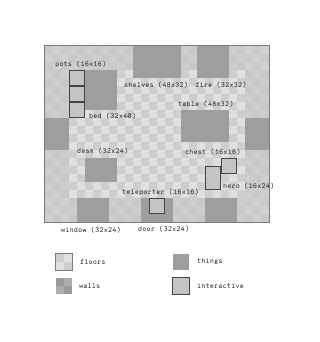

# Just a Passenger

(wip) game

### Images

#### External Resources

- [True20 Core Rules](http://www.askadesign.com/tchristensen1981/True20/True20/Core/Adventure_Roleplaying_Revised_Edition_True20.pdf)
- [Nautical Terms](http://memory-alpha.wikia.com/wiki/Nautical_terms)
- [d20 Modern Reference Documents (v3.5)](http://dmreference.com/MRD/)
- [d20 startships](http://www.d20resources.com/future.d20.srd/starships/)
- [Spaceship Zero Technical Manual](http://freeronin.com/gr_files/SSZ_tech_manual.pdf)
- [A Guide to the Zelda ALTTP Art-Style](http://w11.zetaboards.com/OoT_2D/topic/10959899/1/)
- [Bulk Freighter d20](http://www.d20resources.com/future.d20.srd/starships/starship.types/mediumweight.starship.subtypes/bulk.freighter.php)
- [The Firefly and Serenity database](http://firefly.wikia.com/wiki/Main_Page)